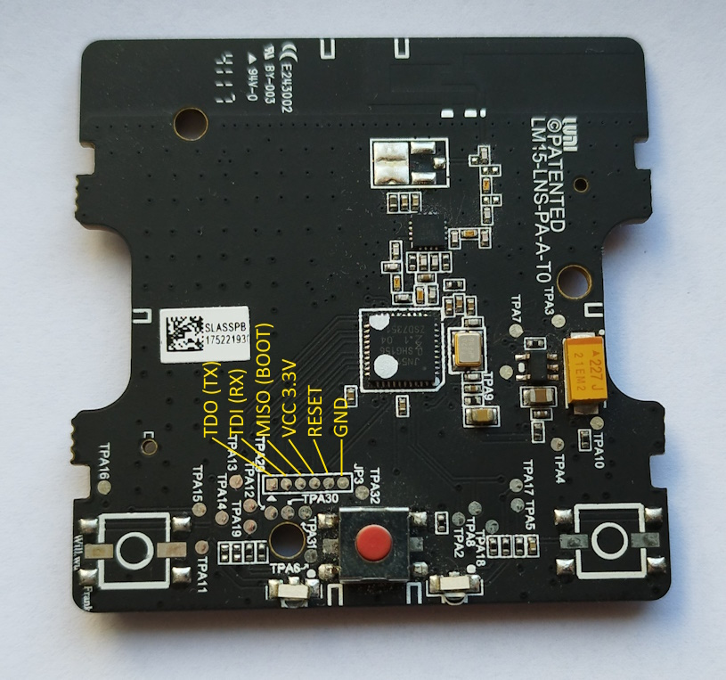
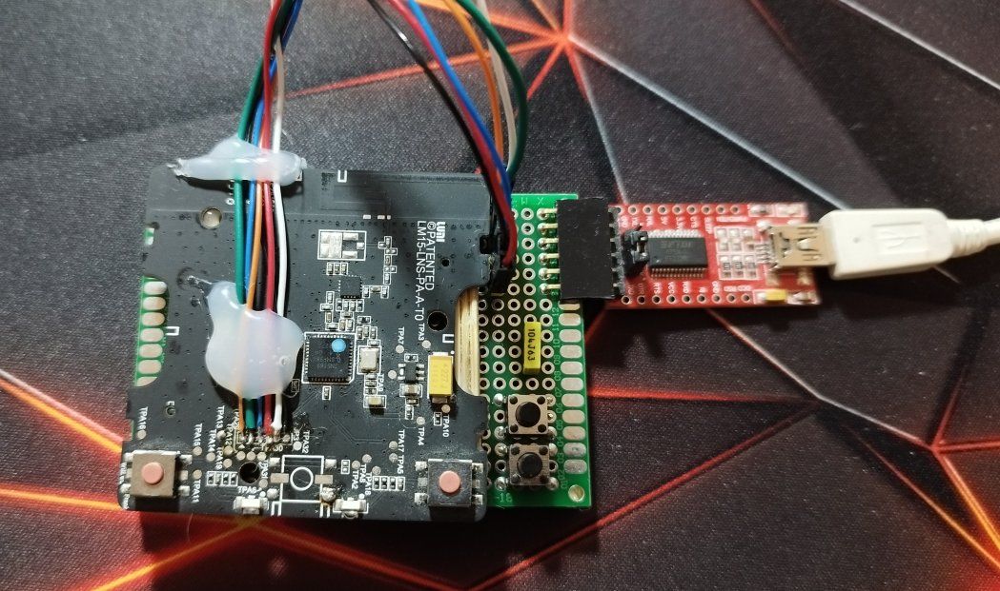
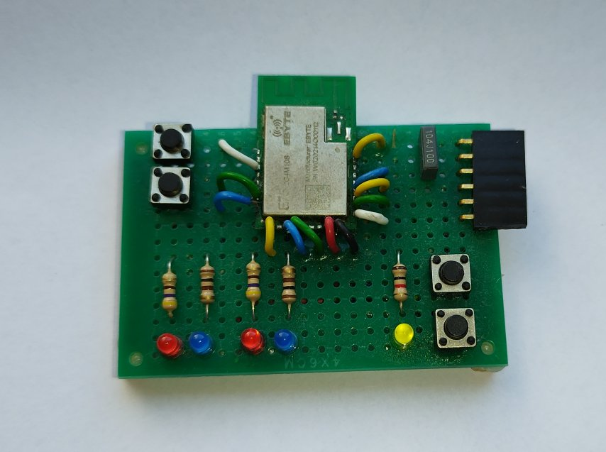

# Hello NXP JN5169 ZigBee World Project

## Goals

This project has two main objectives:
- delve into how Zigbee technology operates and share this knowledge [through a tutorial](doc/part0_plan.md), making it accessible for more people to engage with this technology
- develop alternative firmware for the Xiaomi Aqara QBKG12LM Zigbee smart switch, and a few other Xiaomi devices.

The NXP JN5169 microcontroller was chosen for its use in Xiaomi devices manufactured between 2017 and 2021. NXP offers detailed documentation, SDK source codes, and numerous examples, facilitating the development of custom Zigbee solutions. However, the wealth of information provided by NXP can be overwhelming for newcomers to Zigbee technology. To address this, a step-by-step tutorial was created to simplify the learning process.

The following devices are the target for this project:
  - QBKG11LM and QBKG12LM switches with neutral line
  - QBKG03LM and QBKG04LM switches without the neutral line (support pending)
  - LLKZMK11LM double relay module (support pending)
  - Possibly other Aqara devices
  - Any switches and Zigbee solutions based on NXP JN5169 microcontroller

## Features

The original Xiaomi Aqara QBKG12LM smart switch provides a very limited functionality. It cannot bind to other devices, does not handle multiple clicks, cannot work as a group client, and lacks many features that other modern smart switches provide. Also, stability of the original firmware is not always good.

The alternative firmware features are:
- Zigbee router or end device
- 1 or 2 button channels, each of them offers
  - Button supports single, double, triple, and long presses (press and hold)
  - Relay may be assigned to a certain button press type, or decoupled from the button
  - Number of settings to fine tune the mode and behavior of the switch.
  - Instant feedback on the button press
  - Button interlock modes (not relevant for 1-button devices)
  - Both buttons pressed simultaneously can be assigned with additional actions.
  - Server mode: the device maintain its internal relays, and allow it to be controlled with the button, or externally from the network
  - Client mode (device binding): the device buttons can be bound to other devices, and control their state
  - Controlling On/Off type devices, as well as dimmable lights and curtains/shades
- The following Zigbee clusters are supported:
  - On/Off zigbee cluster to report state change, as well as handling toggle commands
  - Extended On/Off Configuraiton Cluster to configure device behavior
  - Multistate input cluster to report single/double/triple/long press actions
  - Groups support in 2 ways:
    - Device button may control a group of light devices
    - Device LEDs/Relay can be a part of a group, and controlled externally
  - Identify cluster that allows the device to identify itself among other similar devices
- OTA firmware update
- Zigbee2mqtt integration via external converter


# Target hardware

The code in this project is designed to be modular, allowing it to run on various hardware platforms, assuming they are based on the JN5169 microcontroller. Here are some of the boards that the code is compatible with.

## QBKG11LM and QBKG12LM switches

The main focus of this project are the QBKG11LM and QBKG12LM switches (1-gang and 2-gang switches with a neutral line). Both models share the same PCB layout, differing only in the number of buttons and relays installed.

The board schematics have been reverse engineered and are detailed [here](doc/part26_QBKG12LM_support.md). These devices are self-contained, featuring their own power supply, MCU, antenna circuits, buttons, LEDs, and relays. There's no need to modify any components of the mass-produced device for this project.

The MCU board has several pads designed for connecting a flashing tool.



The NXP JN5169 microcontroller can be programmed using a standard USB-UART adapter attached to these pads. To enter bootloader mode, the MISO line must be grounded during reset. An adapter like the shown below can be used for this purpose. The capacitor connected to the DTR pin can be skipped if you're only flashing the microcontroller and don't intend to conduct automated tests.


**Warning!!!** Do not connect USB-UART converter if the switch is connected to the mains power.

Alternatively, the MCU board can be separated from the power board. In this case it can be used as a development board with no risk of high voltage injury.




## Development board based on EBYTE E75-2G4M10S module

To avoid risking damage to an expensive Xiaomi device, you can use a more affordable development board equipped with the EBYTE E75-2G4M10S module.


This board features several LEDs and buttons, and supports programming and debugging through UART. It's suitable for learning Zigbee technology and developing most functionalities of a real device.



# How to build

Prerequisites (Windows Only):
- Beyond Studio IDE (comes with a JN5169 compiler)
- ZigBee SDK (JN-SW-4170 Zigbee 3.0 v1840.zip)
- CMake (any recent one)
- MinGW (or other source where you can get `make`)
- Python

Build instructions:
- Clone the repo
- make a `build` directory
- `cd build`
- `cmake -G "MinGW Makefiles" -DTOOLCHAIN_PREFIX=C:/NXP/bstudio_nxp/sdk/Tools/ba-elf-ba2-r36379 -DSDK_PREFIX=C:/NXP/bstudio_nxp/sdk/JN-SW-4170 ..`
(Correct paths to the toolchain and sdk if needed)
  - If your tools are installed at default locations, you can also use Cmake presets: `cmake -G "MinGW Makefiles" --preset=default ..`
- Useful targets:
  - `mingw32-make HelloZigbee.bin` to build a binary that can be flashed to the device
  - `mingw32-make HelloZigbee.flash` to build and immediately flash the binary
  - `mingw32-make HelloZigbee.ota` to build a binary that can be used for OTA updates
- Other userful CMake switches:
  - `-DBOARD=QBKG12LM` to select target device (by default EBYTE E75-2G4M10S is selected)
  - `-DBUILD_NUMBER=123` to set the build number (build number uploaded via OTA must be higher than the current firmware build number)

Note: the instructions above are for Windows only. However, a few user reported they were able to run the build process on Linux and Mac platforms. Feel free to contribute.

Flash instructions:
- Open Beyond Studio
- Put the device in the programming mode (drive SPI_MISO low while reset or power up)
- Go to Device->Program Device
- Select the built HelloWorld.bin file
- Click `Program` button

or

- Put the device in the programming mode (drive SPI_MISO low while reset or power up)
- `mingw32-make HelloZigbee.flash`

# Zigbee2mqtt integration

## External Converter

When joined the network, the zigbee2mqtt will list the device as unsupported. No features will be exposed. 

To integrate the device follow these steps:
- Put `zigbee2mqtt/myswitch.js` to zigbee2mqtt configuration folder (next to `configuration.yaml`)
- In `configuration.yaml` add the following entity

```yaml
external_converters:
  - myswitch.js
```

After z2m restart the device features will be supported by zigbee2mqtt.

## OTA Update

The firmware supports [OTA update feature](doc/part25_ota_updates.md). 

The OTA feature requires the firmware to be prepared in a special way, use the `HelloZigbee.ota` build target to prepare a firmware suitable for OTA update. Also, the firmware must be configured with the build number which is higher than current firmware build number, otherwise firmware update process will reject the new firmware (use `-DBUILD_NUMBER=xxx` cmake switch to set the build number).

The built firmware shall be uploaded to the zigbee2mqtt data folder, next to the configuration.yaml. In order to let zigbee2mqtt know about available firmware, an [OTA index override file](https://www.zigbee2mqtt.io/guide/usage/ota_updates.html#local-ota-index-and-firmware-files) shall be created:

```json
[
    {
        "url": "HelloZigbee.ota",
		"force": true
    }
]
```

Also add the path to this index file to the configuration.yaml:

```yaml
ota:
    zigbee_ota_override_index_location: index.json
```

The device will be listed on the Zigbee2mqtt OTA page. Click on the `Check firmware update` will check the firmware availability, and offer to update the firmware. The `Update firmware` button will start the update process.

## Switching between stock QBKG12LM firmware and HelloZigbee custom one

Hello Zigbee firmware identifies itself in the same way as official Xiaomi Aqara firmwares do. Since first series of Xiaomi Aqara devices (including QBKG11LM and QBKG12LM) do not use firmware encryption and special protection, custom Hello Zigbee firmware can be uploaded to the mass produced device over the air.

To update from stock firmware to Hello Zigbee one the following index override file shall be used (use `lumi.ctrl_ln2.aq1` for QBKG11LM):

```json
[
    {
        "modelId": "lumi.ctrl_ln2.aq1",
        "url": "HelloZigbee.ota",
        "force": true
    }
]
```

The build number of the new firmware shall be higher than one used in the stock firmware (the [latest official version](https://github.com/Koenkk/zigbee-OTA/blob/master/images/Lumi/20230202185209_OTA_lumi.ctrl_ln2.aq1_0.0.0_0095_20220725_0B0798.ota) build number is 95). 

In order to switch back from Hello Zigbee firmware to the stock one, a similar procedure can be used.

[
    {
        "modelId": "hello.zigbee.QBKG12LM",
        "url": "https://github.com/Koenkk/zigbee-OTA/blob/master/images/Lumi/20230202185209_OTA_lumi.ctrl_ln2.aq1_0.0.0_0095_20220725_0B0798.ota",
        "force": true
    }
]

# How to use

## Network joining

The device implements a common type of home automation devices. On the first start the device is not connected to the network. Press and hold both device buttons for 5 seconds in order to initiate the network joining. Make sure your network permits joining, otherwise the device is not able to join. 

Once the device joined the network, zigbee2mqtt will start intervieweing the device, which will take up to 15 seconds. If the zigbee2mqtt external converter is installed, the z2m system will provide full access to the device features.

Device automatically tries to rejoin the network if network conditions change (e.g. parent/neighbour router no longer responds). Device joining and rejoining, as well as failure recovery is implemented using BDB component (a part of Zigbee SDK). The device performs several rejoin attempts before giving up. Pressing both device buttons for 5 seconds will force device to leave the network.

## Main functionality

The device implements a typical smart switch functionality. By default it operates as a normal switch: when pressing a button toggles the LED. Since this is a smart switch, it will also report its state to the Zigbee2Mqtt , as well as accept On/Off/Toggle commands from the network.

But the default behavior can be customized using the custom On/Off Configuration Cluster. 

The settings are:
- `Operating Mode`:
	- `Server` - the endpoint maintains internal state, drives its LED/Relay, and generates reports on state change.
    - `Client` - the endpoint generates On/Off/Toggle commands to bound devices. Local LED/Relay is not used.
- `Switch Mode`:
	- `Toggle` - each button press toggles the LED. The action happens immediately when button pressed. This mode provides the fastest feedback.
	- `Momentary` - turns On LED when the button is pressed, and turns Off when released.
	- `Multifunction` - a smart switch mode, that allows fine tuning of the switch behavior, supports single/double/tripple/long press, and controlling dimming lights and shades. See other options below for more details.
- `Switch actions` (applicable for `Momentary` switch mode only):
	- `onOff` - turns on the LED when the button is pressed, and turns it off when released
	- `offOn` - turns off the LED when the button is pressed, and turns it on when released
	- `toggle` - toggles the LED each time when button is pressed or released
- `Relay mode` - applicable for all `Multifunction` mode, and allow fine tuning of the device behavior, as well as assigning multiple actions to the device dependning on clicks count:
	- `Unlinked` - with this option the internal LED (and relay actuator on the real smart switch) will be decoupled from the button. In this mode the button will generate logical signals to the network, while the LED will retain its state. At the same time it is possible to control the LED via network commands.
	- `front` - the relay toggles once the button is pressed. This mode provides the fastest feedback, compared to the other options below. The device will also generate a `single press` action to the network.
	- `single` - the relay toggles once the button is quickly pressed once. The device will also generate a `single press` action to the network. Note that the action triggers with a short delay to ensure there are no further clicks happening.
	- `double` - the relay toggles once the button is quickly pressed twice. The device will also generate a `double press` action to the network. Note that the action triggers with a short delay to ensure there are no further clicks happening.
	- `tripple` - the relay toggles once the button is quickly pressed 3 times. The device will also generate a `tripple press` action to the network. 
	- `long` - the relay toggles once the button is pressed, and remains pressed for some time (typically a 0.5s). The device will also generate a `long press` action to the network, and the `release` action when button is finallyreleased.
- `Long Press Mode` is a special setting for the Long Press action (when the button is pressed and hold for at least 0.5s). This setting allows adding dimming light control to the button. Note, that this function requires binding the button to the dimming light device:
	- `None` - no additional functionality (except for emiting `long press` action to the network) is triggered
	- `levelCtrlUp` - when the button is pressed, the LevelCtrl cluster `MoveUpWithOnOff` command is emitted. When the button is released, the LevelCtrl cluster `Stop` command is emitted to stop previously started movement
	- `levelCtrlDown` - Similar to previous, but the `MoveDownWithOnOff` command will be used.
- `Interlock Mode` is a mode when both switch buttons work together, and do not allow setting both endpoints to ON state simultaneously:
	- `None` - interlock mode is deactivated
	- `Mutual Exclusion` - Prevents two endpoints to be in ON state simultaneously. When second endpoint gets ON, previously active endpoint gets OFF. This mode allows setting both endpoints to OFF state.
	- `Opposite` - the two endpoints are also in opposite state. If one of them goes ON, another goes OFF, and vice versa.
- `Max Pause` - a maximum time between button clicks so that consecutive clicks are consodered as a part of a multi-click action.
- `Min Long Press` - a minimum time of the button press before emitting a `long press` action

## Other features

The device also support a few handy functions:
- Button channels support binding to other devices, so that buttons can generate On/Off commands to the bound device. Note that bound transfer works even without the coordinator, so that it is possible to make autonomous control of a light from this smart switch device.
- The button channels can be bound to a light group, so that multiple devices can be controlled with a single button
- The device LEDs may be added to a group as a light device. In this case other switches may control the device's LED.
- The device supports Identify cluster. Once received the Identify command, the device will start slow breathing effect on its LED, identifying itself among other devices. The device supports Identify commands on a single button channel.
- The device supports the OTA firmware update.

A special behavior is implemented, depending on whether device is bound or not:
	- If the device is not bound to any other device - on button press it sends reports to the coordinator
	- If the device is bound to another device - on button press it sends Toggle command to the bound device(s)


# Tests

The project functionality comes with a comprehensive set of automated tests, covering main functionality of the device. These tests help keeping the code healthy regardless of changes being made.

To run tests:
- Install python and pytest
- Register the switch in the zigbee2mqtt
- Edit `tests\pytest.ini` file, specify parameters applicable for your setup (COM port, zigbee2mqtt address, device name, target board name, etc)
- `cd tests`
- `pytest`

The `-o` pytest option can be used to override default pytest.ini settings:
- `-o device_name=XXXXXX` to specify zigbee2mqtt device name
- `-o target_board=QBKG12LM` to set the proper device type
- `-o port=COM10` to set the COM port

# Documentation

All this code is explained in very detail in the [Hello Zigbee article series](doc/part0_plan.md)

# Support

This project is being developed for free as a pet project. At the same time you may consider supporting the project with a small donate.

<a href="https://www.buymeacoffee.com/grafalex" target="_blank"></a>
